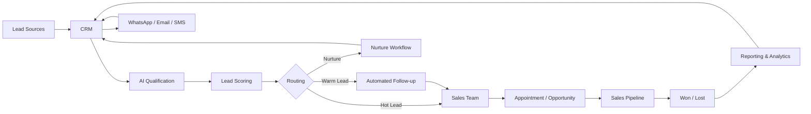

# AI Automation Playbooks

### Practical AI Integration & Business Automation Frameworks

A public knowledge repository by **Prashant Rajput**, Founder of [Touchstone Infotech](https://www.touchstoneinfotech.com/), focused on practical AI integrations, CRM automation, lead management and connected revenue workflows.

This repository documents implementation frameworks, checklists and playbooks designed to help businesses use AI and automation in ways that improve speed, consistency, visibility and revenue operations.

---

## What This Repository Covers

### 🤖 AI Integrations
- AI-assisted lead qualification
- AI-powered customer responses
- AI appointment booking
- AI workflow triggers
- AI-assisted sales operations
- AI-based data enrichment
- AI reporting and summarization
- AI agents for practical business workflows

### 🔁 Business Automation
- Lead routing
- Follow-up automation
- Pipeline automation
- Appointment reminders
- Missed-call follow-up
- Sales handoff workflows
- Internal notifications
- Customer lifecycle automation

### 💬 CRM & Communication
- CRM workflow design
- WhatsApp automation
- Email automation
- SMS automation
- Lead scoring
- Opportunity management
- Contact segmentation
- Multi-channel communication workflows

### 📊 Revenue Operations
- Marketing-to-CRM integration
- Lead-source tracking
- Conversion tracking
- Sales pipeline visibility
- Revenue reporting
- Attribution workflows
- Dashboard integrations
- Operational handoffs

---

## Frameworks & Resources

This repository will gradually include practical resources such as:

### ⭐ First Planned Resource

**AI Automation Readiness Checklist**

A practical checklist to help businesses determine where AI and automation can create real operational value before investing in tools or complex workflows.

| Resource | Status |
|---|---|
| [AI Automation Readiness Checklist](ai-automation-readiness-checklist.md) | ✅ Published |
| [AI Lead Qualification Framework](ai-lead-qualification-framework.md) | ✅ Published |
| CRM Lead Routing Playbook | 📌 Planned |
| WhatsApp Follow-up Automation | 📌 Planned |
| AI Appointment Booking Workflow | 📌 Planned |
| Marketing-to-CRM Integration Blueprint | 📌 Planned |
| Revenue Automation Framework | 📌 Planned |

Resources will be added as they are completed and tested rather than publishing empty folders.

---

## My Approach

## Connected AI Automation Architecture

A practical AI automation system should connect acquisition, customer data, AI decision support, communication and human sales workflows.

### What this architecture represents

**Lead Sources → CRM → AI Qualification → Lead Scoring → Routing → Automation/Human Sales → Pipeline → Revenue Outcome → Reporting**

The CRM remains the central system of record, while AI assists with interpretation and prioritization. Automation handles repetitive actions, and important conversations move to people.

---

## Example Automation Architecture

A typical connected revenue workflow may look like:

**Lead Source → CRM → Qualification → Lead Scoring → Assignment → WhatsApp/Email Follow-up → Appointment → Sales Pipeline → Reporting**

AI can be introduced where it adds practical value:

**Lead → AI Qualification → CRM → Automated Nurture → Human Sales Conversation**

The technology should support the customer journey rather than make it feel robotic.

---

## Common Use Cases

### Lead Management
- Automatically capture enquiries
- Route leads by location, product or service
- Prioritize high-intent opportunities
- Follow up when sales teams do not respond

### Customer Communication
- Answer common questions
- Send reminders
- Re-engage inactive leads
- Provide booking and rescheduling options

### Sales Operations
- Create opportunities automatically
- Update pipeline stages
- Notify sales representatives
- Track lost and inactive opportunities

### Reporting
- Consolidate data across systems
- Track lead sources
- Monitor response times
- Measure funnel conversion
- Surface operational bottlenecks

---

## AI + Human Workflows

Not every conversation should be automated.

I prefer a hybrid model:

**Automation handles repetition.  
AI handles assistance and prioritization.  
Humans handle judgment, trust and important conversations.**

This is particularly important in industries where buyers require consultation, confidence and relationship-building.

---

## Industry Experience

My work with automation and connected revenue systems includes:

`SaaS` · `Real Estate` · `Education` · `Ecommerce` · `Clinics` · `Local Businesses`

---

## About Me

I'm **Prashant Rajput**, Founder of [Touchstone Infotech](https://www.touchstoneinfotech.com/).

I work across **AI, automation, SEO/GEO, CRM, performance marketing and system integration**, building practical systems that connect acquisition, customer communication and sales operations.

- 13+ years in digital growth and technology
- 300+ businesses supported
- Experience across India, USA, UK, Canada & Australia
- ₹2–3 Cr+ annual media spend managed
- Leading a 26-person growth and technology team

---

## Cloud, AI & Automation Credentials

- AWS Certified Solutions Architect – Professional
- AWS Certified AI Practitioner
- AWS Certified Cloud Practitioner
- AZ-305: Designing Microsoft Azure Infrastructure Solutions
- Microsoft 365 Certified: Security Administrator Associate
- WhatsApp Marketing

---

## Connect

🌐 [Touchstone Infotech](https://www.touchstoneinfotech.com/)  
💼 [LinkedIn – Prashant Rajput](https://www.linkedin.com/in/prashant6788/)  
👤 [GitHub – Prashant Rajput](https://github.com/prashant6788)

---

## Repository Roadmap

This repository is an evolving collection of practical AI and automation resources.

New playbooks, checklists, workflow examples and implementation frameworks will be added over time.

If you find the resources useful, consider **starring the repository** to follow future updates.

---

**Maintained by [Prashant Rajput](https://github.com/prashant6788) · Founder, [Touchstone Infotech](https://www.touchstoneinfotech.com/)**
