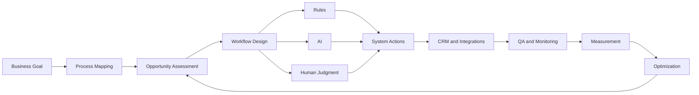

<div align="center">


</div>

<br>

# 🤖 AI Automation Playbooks

### Practical Frameworks for AI, CRM, Workflow Automation & Revenue Operations

**AI Strategy · Workflow Design · CRM · WhatsApp · Human Handoff · QA · Measurement**

A public knowledge repository for designing **reliable, measurable and human-aware AI automation systems**.

<br>

[](ai-automation-strategy-framework.md)
[](ai-workflow-design-framework.md)
[](crm-ai-automation-framework.md)
[](whatsapp-ai-automation-framework.md)
[](ai-automation-qa-checklist.md)

<br>

**Created and maintained by [Prashant Rajput](https://github.com/prashant6788)**  
Founder, [Touchstone Infotech](https://www.touchstoneinfotech.com/)

</div>

---

## 🧭 Start Here

If you are new to the repository, follow this path:

**1. [AI Automation Readiness Checklist](ai-automation-readiness-checklist.md)**  
Determine whether the process and organization are ready for automation.

**2. [AI Automation Strategy Framework](ai-automation-strategy-framework.md)**  
Identify the business outcome, map the process and decide where rules, AI and humans belong.

**3. [AI Automation Opportunity Worksheet](ai-automation-opportunity-worksheet.md)**  
Score and prioritize automation opportunities before building.

**4. [AI Workflow Design Framework](ai-workflow-design-framework.md)**  
Turn the selected process into a reliable workflow architecture.

**5. [AI Workflow Specification Template](ai-workflow-specification-template.md)**  
Document the production design before implementation.

**6. [AI Automation QA Checklist](ai-automation-qa-checklist.md)**  
Test normal cases, edge cases, integrations, AI behavior and recovery paths.

**7. [AI Automation Measurement Framework](ai-automation-measurement-framework.md)**  
Measure reliability, efficiency, AI quality and business impact.

---

# 🧩 The AI Automation System



The objective is **not maximum automation**.

The objective is to create systems that are:

**Reliable · Understandable · Recoverable · Measurable · Human-aware**

---

# 📚 Core Framework Library

| | Resource | Best For |
|---|---|---|
| ✅ | **[AI Automation Readiness Checklist](ai-automation-readiness-checklist.md)** | Assessing whether a process is ready for automation |
| 🧠 | **[AI Automation Strategy Framework](ai-automation-strategy-framework.md)** | Defining business outcomes, boundaries and priorities |
| 🧩 | **[AI Workflow Design Framework](ai-workflow-design-framework.md)** | Architecting production-ready workflows |
| 🎯 | **[AI Lead Qualification Framework](ai-lead-qualification-framework.md)** | AI-assisted lead qualification and scoring |
| 🗂️ | **[CRM + AI Automation Framework](crm-ai-automation-framework.md)** | Connecting CRM, AI, routing, follow-up and pipeline |
| 💬 | **[WhatsApp + AI Automation Framework](whatsapp-ai-automation-framework.md)** | CRM-connected WhatsApp automation |
| 🤝 | **[AI Agent Human Handoff Framework](ai-agent-human-handoff-framework.md)** | AI-to-human escalation and ownership |
| 📊 | **[AI Automation Measurement Framework](ai-automation-measurement-framework.md)** | Reliability, efficiency, quality and ROI measurement |

---

# 🧰 Practical Templates

These resources are designed to be used directly during discovery, implementation and QA.

| | Template | Use It For |
|---|---|---|
| 🔎 | **[AI Automation Opportunity Worksheet](ai-automation-opportunity-worksheet.md)** | Finding and prioritizing automation opportunities |
| 📝 | **[AI Workflow Specification Template](ai-workflow-specification-template.md)** | Documenting implementation-ready workflows |
| 🧪 | **[AI Automation QA Checklist](ai-automation-qa-checklist.md)** | Testing AI, integrations, edge cases and recovery |

---

# 🧪 Implementation Example

### [Open the Sanitized AI Automation Example →](ai-automation-example.md)

A fictional, sanitized B2B services example showing how the repository frameworks can work together:

```text
Inbound Lead
↓
Validation
↓
CRM
↓
AI Requirement Extraction
↓
Structured Output Validation
↓
Business Rules
↓
Qualification
↓
Lead Routing
↓
Acknowledgement
↓
Appointment / Follow-Up
↓
Human Handoff
↓
Pipeline
↓
Measurement
```

The example intentionally avoids fabricated customer results and does not represent a specific Touchstone Infotech client.

---

# 🧠 A Simple Decision Rule

A core principle across this repository is:

```text
Can a reliable rule solve it?
        ↓
      Yes
        ↓
Use deterministic automation

No
↓
Does it require interpretation?
        ↓
      Yes
        ↓
Use narrowly scoped AI

Does it require judgment, approval or ownership?
        ↓
      Yes
        ↓
Use a human
```

In practice, strong systems often combine:

> **Rules + AI + Human Judgment**

---

# 🎯 What This Repository Covers

## AI Automation Strategy

`Process Mapping` · `Opportunity Prioritization` · `AI Suitability` · `Governance` · `Measurement`

## Workflow Architecture

`Triggers` · `Validation` · `Decision Logic` · `Structured Outputs` · `Retries` · `Idempotency` · `Error Handling`

## CRM & Revenue Operations

`Lead Capture` · `Qualification` · `Routing` · `Follow-Up` · `Appointments` · `Pipeline` · `Attribution`

## Conversational Automation

`WhatsApp` · `Intent Classification` · `FAQ Assistance` · `Conversation State` · `Human Handoff`

## QA & Reliability

`Edge Cases` · `API Failures` · `Duplicate Events` · `Model Changes` · `Regression Testing` · `Rollback`

## Measurement

`Reliability` · `Efficiency` · `AI Quality` · `Human Intervention` · `Pipeline` · `Revenue` · `Cost`

---

# 🔄 From Manual Process to AI-Assisted System

```text
MANUAL PROCESS
      ↓
Process Mapping
      ↓
Identify Repetition and Friction
      ↓
Separate Rules from Interpretation
      ↓
Design Workflow
      ↓
Add AI Only Where Useful
      ↓
Define Human Handoff
      ↓
Integrate CRM and Systems
      ↓
Test Failures and Edge Cases
      ↓
Deploy Carefully
      ↓
Measure
      ↓
Improve
```

---

# 💡 Example Use Cases

This repository can help design systems such as:

- AI-assisted inbound lead qualification
- Automated lead routing
- CRM follow-up automation
- WhatsApp enquiry handling
- Appointment booking and reminders
- No-show recovery
- AI conversation summarization
- Sales handoff workflows
- CRM data enrichment
- Customer-support triage
- Workflow failure recovery
- Search-to-revenue or lead-to-revenue process automation

---

# 🛡️ Reliability Before Autonomy

A recurring principle throughout the repository:

**Do not give AI authority simply because it can generate an answer.**

Production workflows should define:

- What AI may do
- What AI may not do
- Which outputs require validation
- Which decisions remain deterministic
- When a human must take over
- What happens when an API fails
- What happens when information is missing
- How staff can stop or recover the workflow
- How the final business outcome is measured

---

# 🤝 Human Handoff

A good AI automation system knows when to stop.

Typical handoff triggers include:

- Customer explicitly asks for a human
- AI cannot determine intent
- Complaint or sensitive situation
- Pricing negotiation
- High-value opportunity
- Custom technical requirement
- Unsupported question
- Repeated misunderstanding
- Workflow or integration failure

See the **[AI Agent Human Handoff Framework](ai-agent-human-handoff-framework.md)** for the full methodology.

---

# 📊 Measurement Philosophy

Do not evaluate automation using only:

```text
Number of Workflows Run
Number of Messages Sent
Number of AI Calls
```

Measure the actual process:

```text
Reliability
      ↓
Processing Time
      ↓
AI Quality
      ↓
Human Intervention
      ↓
Customer Outcome
      ↓
Qualified Leads
      ↓
Appointments
      ↓
Opportunities
      ↓
Pipeline / Revenue
      ↓
Cost
```

See the **[AI Automation Measurement Framework](ai-automation-measurement-framework.md)**.

---

# 🏗️ Repository Structure

```text
ai-automation-playbooks/
│
├── README.md
├── CONTRIBUTING.md
├── LICENSE
│
├── ai-automation-readiness-checklist.md
├── ai-automation-strategy-framework.md
├── ai-lead-qualification-framework.md
├── ai-workflow-design-framework.md
├── crm-ai-automation-framework.md
├── whatsapp-ai-automation-framework.md
├── ai-agent-human-handoff-framework.md
├── ai-automation-measurement-framework.md
│
├── ai-automation-opportunity-worksheet.md
├── ai-workflow-specification-template.md
├── ai-automation-qa-checklist.md
│
└── ai-automation-example.md
```

---

# 👤 About the Maintainer

## Prashant Rajput

Founder of [Touchstone Infotech](https://www.touchstoneinfotech.com/).

I work across:

**AI · Automation · CRM · SEO/GEO · Performance Marketing · System Integration**

My focus is building practical systems that connect:

**Lead Generation → CRM → Automation → AI → Sales Operations → Revenue Measurement**

### Experience

- **13+ years** in digital growth and technology
- **300+ businesses** supported
- Experience across **India, USA, UK, Canada & Australia**
- Working across automation, CRM, AI-assisted workflows and digital growth systems
- Leading a growth and technology team at Touchstone Infotech

### Connect

🌐 [Touchstone Infotech](https://www.touchstoneinfotech.com/)  
💼 [LinkedIn – Prashant Rajput](https://www.linkedin.com/in/prashant6788/)  
👤 [GitHub – Prashant Rajput](https://github.com/prashant6788)

---

# 🗺️ V1 Status

## Core Strategy

- [x] AI Automation Readiness Checklist
- [x] AI Automation Strategy Framework

## Implementation Frameworks

- [x] AI Lead Qualification Framework
- [x] AI Workflow Design Framework
- [x] CRM + AI Automation Framework
- [x] WhatsApp + AI Automation Framework
- [x] AI Agent Human Handoff Framework

## Operations & Measurement

- [x] AI Automation Measurement Framework
- [x] AI Automation Opportunity Worksheet
- [x] AI Workflow Specification Template
- [x] AI Automation QA Checklist

## Proof of Application

- [x] Sanitized AI Automation Implementation Example

## Repository Governance

- [x] CONTRIBUTING.md
- [x] CC BY 4.0 License

**AI Automation Playbooks V1 is complete.**

Future additions should focus on genuine implementation learnings, useful examples and tested improvements—not publishing files for volume.

---

# 🔮 Potential Future Additions

Possible future resources may include:

- AI Support Triage Example
- AI Appointment Automation Example
- CRM Lead Routing Example
- Automation Incident Review Template
- AI Workflow Monitoring Dashboard Template
- Practical system-integration patterns

These should be added only when they provide clear incremental value.

---

# 🤝 Contributing

Suggestions, corrections and practical implementation improvements are welcome.

Please read **[CONTRIBUTING.md](CONTRIBUTING.md)** before submitting changes.

Useful contributions include:

- Better failure handling
- Workflow edge cases
- AI validation improvements
- Human-handoff patterns
- QA improvements
- Measurement improvements
- Security and privacy considerations
- Clearer implementation examples

Please avoid:

- Promotional backlinks
- Generic AI filler
- Fabricated statistics
- Fake case studies
- Unsupported AI claims
- Credentials or sensitive data

---

# ⚠️ Important Note

AI models, APIs, CRM systems, messaging platforms and automation tools change continuously.

These resources are intended as **practical working frameworks**, not guarantees of:

- AI accuracy
- Workflow reliability
- Conversion improvement
- Revenue growth
- Platform compatibility
- Regulatory compliance

Production implementations should be evaluated against:

- Current vendor documentation
- Security requirements
- Privacy requirements
- Applicable regulations
- Business policy
- Data sensitivity
- Real-world testing

---

# 📄 License

The original frameworks, worksheets, templates, checklists and examples in this repository are licensed under the **Creative Commons Attribution 4.0 International (CC BY 4.0) License**, unless otherwise noted.

You may share and adapt the material, including for commercial purposes, provided appropriate attribution is given.

**Suggested attribution:**

> AI Automation Playbooks by Prashant Rajput  
> https://github.com/prashant6788/ai-automation-playbooks

See [LICENSE](LICENSE) for the full license terms.

---

<div align="center">

## 🤖 AI Automation Playbooks

**Strategy · Workflows · CRM · AI · Human Handoff · QA · Measurement**

Maintained by **[Prashant Rajput](https://github.com/prashant6788)**  
Founder, **[Touchstone Infotech](https://www.touchstoneinfotech.com/)**

[LinkedIn](https://www.linkedin.com/in/prashant6788/) · [GitHub](https://github.com/prashant6788) · [Touchstone Infotech](https://www.touchstoneinfotech.com/)

</div>
