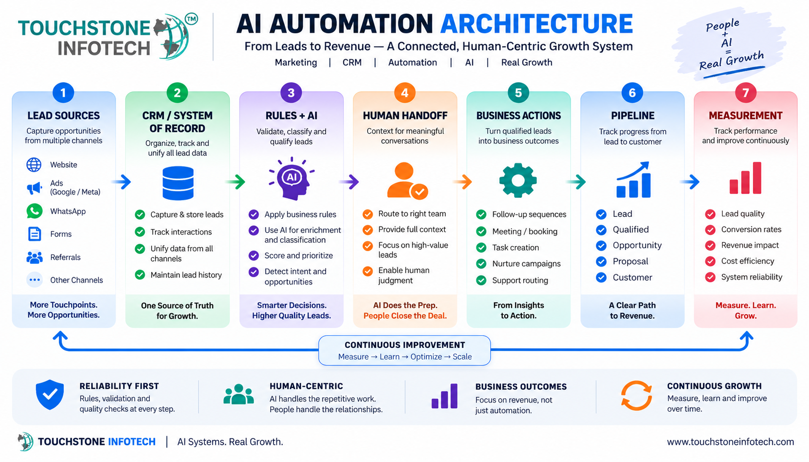

<div align="center">

# 🤖 AI Automation Playbooks

### Practical Frameworks for AI, CRM, Workflow Automation & Revenue Operations

**AI Strategy · Workflow Design · CRM · WhatsApp · Human Handoff · QA · Measurement**

A public knowledge repository for designing **reliable, measurable and human-aware AI automation systems**.

<br>

[](ai-automation-strategy-framework.md)
[](ai-workflow-design-framework.md)
[](crm-ai-automation-framework.md)
[](whatsapp-ai-automation-framework.md)
[](ai-automation-qa-checklist.md)

<br>

**Created and maintained by [Prashant Rajput](https://github.com/prashant6788)**  
Founder, [Touchstone Infotech](https://www.touchstoneinfotech.com/)

</div>

---

<div align="center">



</div>

---

## 🧭 Start Here

If you are new to the repository, follow this path:

**1. [AI Automation Readiness Checklist](ai-automation-readiness-checklist.md)**  
Determine whether the process and organization are ready for automation.

**2. [AI Automation Strategy Framework](ai-automation-strategy-framework.md)**  
Identify the business outcome, map the process and decide where rules, AI and humans belong.

**3. [AI Automation Opportunity Worksheet](ai-automation-opportunity-worksheet.md)**  
Score and prioritize automation opportunities before building.

**4. [AI Workflow Design Framework](ai-workflow-design-framework.md)**  
Turn the selected process into a reliable workflow architecture.

**5. [AI Workflow Specification Template](ai-workflow-specification-template.md)**  
Document the production design before implementation.

**6. [AI Automation QA Checklist](ai-automation-qa-checklist.md)**  
Test normal cases, edge cases, integrations, AI behavior and recovery paths.

**7. [AI Automation Measurement Framework](ai-automation-measurement-framework.md)**  
Measure reliability, efficiency, AI quality and business impact.

---

# 🧩 The AI Automation System

```mermaid
flowchart LR
    A["Business Goal"] --> B["Process Mapping"]
    B --> C["Opportunity Assessment"]
    C --> D["Workflow Design"]
    D --> E["Rules"]
    D --> F["AI"]
    D --> G["Human Judgment"]
    E --> H["System Actions"]
    F --> H
    G --> H
    H --> I["CRM and Integrations"]
    I --> J["QA and Monitoring"]
    J --> K["Measurement"]
    K --> L["Optimization"]
    L --> C
